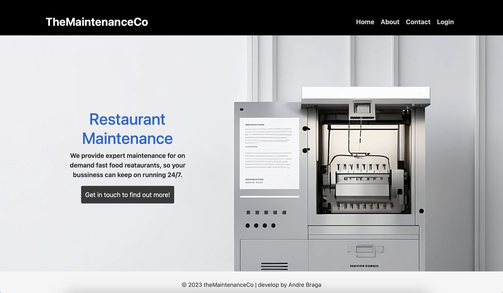

# **TheMaintenanceCo**

TheMaintenanceCo is a fictional website for a fast food specific maintenance company. The website deploys a dashboard for three different types of users: manager, client and employee. The dashboard is customized for the needs of each user type. In the client dashboard the user can create categories and add equipments to each individual ones depending on the restaurant needs. The client can add, edit and delete jobs. In the manager dashboard the user can view, edit, delete and assign jobs to an employee. In the employee dashboard, the user is displayed with all jobs assigned to him only. The employee can add relevant feedback and mark jobs as done. When a job is marked as done, it moves to the completed jobs list. In this list a manager can still edit, delete or reopen jobs if needed, moving it back to the active list.
The website was developed with a minimalistic and clean design goal, only showing essencial elements when required to make the dashboard easy to use without overcomplicating things.
This fictional project was developed as a Portfolio Project 4 - Full Stack Website as part of the Diploma in Full Stack Software Development from [Code Institute](https://www.codeinstitute.net).

[You can view the live website here](https://the-maintenance-co.herokuapp.com)

# Table of Content

- [**Project**](#project)
    - [Objective](#objective)
    - [Site Users Goal](#site-users-goal)
    - [Site Owners Goal](#site-owners-goal)
    - [Project Management](#project-management)

- [**User Experience (UX)**](#user-experience-ux)
    - [Wireframes](#wireframes)
    - [User Stories](#user-stories)
    - [Site Structure](#site-structure)
    - [Design Choices](#design-choices)

- [**Features**](#existing-features)
    - [Home page](#home-page)
        - [*Home*](#home)
        - [*Navigation*](#navigation)
        - [*About*](#about)
        - [*Contact*](#contact)
        - [*Login*](#login)

# **Project**

## Objective
The objective of this project was to create a dashboard job management tool that can be used by a maintenance company to keep track of jobs or tasks that need to be completed. It also serves as a tool for client, employee and management to communicate the different equipment maintenance needs. This was a good opportunity for me to develop and demonstrate my knowledge of HTML, CSS, JS, Python and the Django Framework all working together in a Full Stack solution.

## Site Users Goal
The site user if a client can log jobs for different maintenance needs of equipments in the restaurant. If an employee of the company it serves as a platform to organize all assigned jobs and a way to keep track of all the work done and feedback given.

## Site Owners Goal
The site owner uses the dashboard to organize the different maintenance services and is a powerfull tool to share with the company's clients.

## Project Management

### Github Board
In order to keep everything organized I used Github's built in project board to add all the different user stories and to move them along as they we're being completed. It worked really well for me and had a natural logical feel to it.

<b>Github's project management board</b>

 

[Back to top](<#table-of-content>)

### Database Schema
I wrote down the different models and fields I would need for the project in a numbers spreadsheet. It helped me go throught the logic of the different models and their relationship to one another.

I created the following models for the project:

- **Profile (user profile)** - A model created to store additional user information and is linked to the default user model from allauth.
- **Category** - Stores all the client created categories of equipments in the restaurant. It is a foreign key to the equipments model.
- **Equipment** - Stores all the different types of equipments in the store, it takes the category and user models as foreign key's.
- **Job** - This models stores all data relevant to the job a user created and has the user, category, equipment as foreign keys's.

<b>Database ERD (Entity Relationship Diagram)</b>

 

# **User Experience (UX)**

## Wireframes
A created all the initial wireframes using [Balsamiq](https://balsamiq.com). They were created with a desktop and responsive mobile options. There are some slight differences to the final project as some design choices where changed during the development process to pressent a better user experience.

<b>Wireframes</b>

 

## User Stories
This first step for this project was to write the user stories. They were used to guide the development and were divided in three user types: manager, client an employee. In the [testing](#testing) section I evaluate the outcome of each.

### Manager site user
|   |   |   |
|--------|--------|--------|
| As a Manager | I can access the managers dashboard so I can view new, active, and completed jobs. | &check; |
| As a Manager | I can create, update and delete users so I can manage access and permissions. | &check; |
| As a Manager | I can assign jobs to employees so I can plan what each employee will work on. | &check; |
| As a Manager | I can mark jobs as complete so I can review any feedback before closing the job. | &check; |
| As a Manager | I can approve job deletion request so I can verify the actual necessity of the job. | &check; |
| As a Manager | I can reopen jobs so that I can move them from the completed to the active jobs list. | &check; |
| As a Manager | I can reassign a job so that I can assign it to a different employee. | &check; |

### Client site user
|   |   |   |
|--------|--------|--------|
| As a Client | I can view the home page with a menu so I can navigate to different pages. | &check; |
| As a Client | I can access the dashboard so I can view new, active and completed jobs information. | &check; |
| As a Client | I can add a new job so I can communicate the relevant maintenance needs. | &check; |
| As a Client | I can edit a job so I can update relevant information for that job. | &check; |
| As a Client | I can request that a job be deleted so I can remove it from the active list. | &check; |
| As a Client | I can send a message so I can communicate with the company.| &check; |
| As a Client | I can add / edit categories so that I can organize equipments in them. | &check; |
| As a Client | I can add an equipment so that I can create a job for it. | &check; |
| As a Client | I can edit / delete and equipment so that I can organize the equipment list. | &check; |
| As a User | I can filter the jobs so that I can search for the relevant ones. | &check; |

### Employee site user
|   |   |   |
|--------|--------|--------|
| As an Employee | I can access the employee dashboard so I can view jobs that have been assigned to me. | &check; |
| As an Employee | I can add feedback to jobs so I can communicate any extra needs. | &check; |
| As an Employee | I can mark jobs as done so I they can be moved to the completed list. | &check; |

[Back to top](<#table-of-content>)

## Site Structure
TheMaintenanceCo is divided in four parts: **home page, manager dashboard, client dashboard and employee dashboard**. When a user logs in it check the user type and redirect the user to the correct dashbaord. All views have relevant permissions so user cannot access a page that is not allowed by their user type, if they try to access something outside of the user permission it will redirect them to a 404 page not found.
The home page has a basic structure with a landing, about, contact and login page or logout if the user is already loggedin.
In the manager dashboard the user can view, edit and delete all jobs, add, edit and delete users. For this project the only user that can create a new user is the manager. This is because of the way the company's bussiness model works. The logic is that after a user sign all relevant contracts and paperworks he them receives a username with password with the client dashboard being previously setup by a manager.
In the client dashboard the user can view, edit and delete only jobs from his username. The user can also add, edit and delete categories and equipments. There is also a message page where the client can send an email and some fields are prepopuplated with user data.
In the employee dashboard the user can view all jobs that have been assigned to him, add feedback and mark jobs as done.

You can see all features in detail in the [Features](<#features>) section.

[Back to top](<#table-of-content>)

## Design Choices

* ### Color Scheme
TheMaintenanceCo is built on minimalist design choice, so the color palette select for this project reflects this intention. All caolors are mainly monochromatic shades of black and grey and only the buttons and some link have either a True Blue or Dodger Blue.

* ### Typography
The fonts used for the site are the standard Bootstrap 5 native fonts stack. This system selects the best user firendly font depending on the os the user is using:

- Safari for macOS and iOS: -apple-system;
- Windows: Segoe UI;
- Android: Roboto;
- Linux: Noto Sans, Liberation Sans;
- Fallback fonts: Helvetica Neue, Arial and Sans serif.

To find out more about these Bootstrap option please read the documentation [here](https://getbootstrap.com/docs/5.0/content/reboot/#native-font-stack).

[Back to top](<#table-of-content>)

# **Features**
All the project features are detailed and listed bellow:

## **Home page**

### **Home**
This is the main ladning page with a top navigation menu with link to all pages, a hero image with a call to action button that takes the user to the contact page and a footer.

<b>Home page</b>

 

### **Navigation**
The main navigation menu has a black background with a brand text on the left and navigation link to the right, which are all offwhite. The visible links change depending if a user is looged in or not:

- If the user is logged out he can view: *home*, *about*, *contact* and *login*.
- If the user is logged in he can view: *home*, *about*, *contact*, *dashboard* and *logout*.
- In the dashboard all user view: *logout* and the *user name* that is currently logged in.

<b>Top menu logged out</b>

 

<b>Top menu logged in</b>

 

<b>Top menu in the dashboard</b>

 

[Back to top](<#table-of-content>)

### **About**
The About page is very simple, it only contains some introduction information about the company's service and a link so the user can go to the contact page and send a message for more information.

<b>About page</b>

 

[Back to top](<#table-of-content>)

### **Contact**
The contact page has a form where the sire user can send a message to the company. The message is sent using [EmailJS](https://www.emailjs.com/) api to deliver to the company's email.

<b>Contact page</b>

 

[Back to top](<#table-of-content>)

### **Login**
In the login page the user can enter the username and password, it then validades the user and check which user type it is to redirect the user to the correct dashboard.

<b>Login page</b>

 

[Back to top](<#table-of-content>)