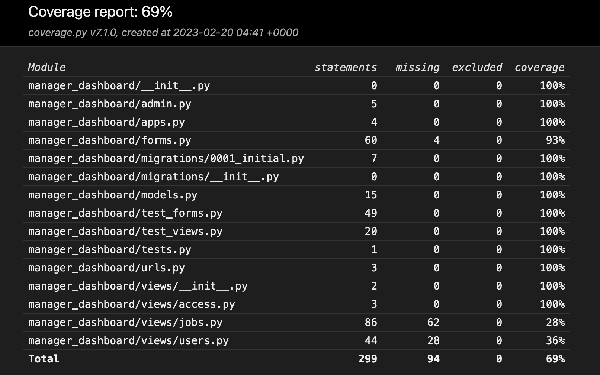

# Table of Content

- [**Testing**](<#testing>)
    - [Testing User Stories](#testing-user-stories)
    - [Code Validation](#code-validation)
    - [Additional Testing](#additional-testing)
    - [Known Bugs](#known-bugs)

## Testing User Stories

- As a Manager I can access the managers dashboard so I can view new, active, and completed jobs.
    - When the user signs in to the website it redirects to the dashboard where the user is presented with new, active and completed jobs.

- As a Manager I can create, update and delete users so I can manage access and permissions.
    - In the manager dashbaord thje user has access to the sign up page and user editing page, to create, edit or delete users.

- As a Manager I can assign jobs to employees so I can plan what each employee will work on.
    - In the new jobs accordion the user can click on assign job and select an employee to assign to.

- As a Manager I can mark jobs as complete so I can review any feedback before closing the job.
    - In the active jobs accordion the user can mark a job as done.

- As a Manager I can approve job deletion request so I can verify the actual necessity of the job.
    - When a client user request a job deletion an option becomes available in the active jobs accordion so the user can approva the job deletion.

- As a Manager I can reopen jobs so that I can move them from the completed to the active jobs list.
    - In the completed jobs list the user can select to reopen a job as required.

- As a Manager I can reassign a job so that I can assign it to a different employee.
    - In the active jobs accordion the manager can reassign a job to a different employee.

- As a Client I can view the home page with a menu so I can navigate to different pages.
    - On the top of the home page there is a menu with links to all the different pages.

- As a Client I can access the dashboard so I can view new, active and completed jobs information.
    - When the user signs in to the website it redirects to the dashboard where the user is presented with new, active and completed jobs.

- As a Client I can add a new job so I can communicate the relevant maintenance needs.
    - In the client dashboard the user can click on add new job where the he can add the job details and save.

- As a Client I can edit a job so I can update relevant information for that job.
    - In the new and active jobs list, the user can click on edit job to edit any relevant information.

- As a Client - I can request that a job be deleted so I can remove it from the active list.
    - When a job is in the active jobs list the user can click on request job deletion so a manager can approve the deletion.

- As a Client  I can send a message so I can communicate with the company.
    - In the dashboard the client can click on send message and a contact forms loads with the user email prepopulated.

- As a Client - I can add / edit categories so that I can organize equipments in them.
    - In the settings page the user can add, edit or delete categories as required.

- As a Client - I can add an equipment so that I can create a job for it.
    - In the settings page the user can add equipments as required.

- As a Client - I can edit / delete and equipment so that I can organize the equipment list.
    - In the settings page the user can edit or delete equipments as required.

- As a User - I can filter the jobs so that I can search for the relevant ones.
    - In the jobs list pages the user has a filter button that opens an input field that will filter throught the jobs id, title and description.

- As an Employee I can access the employee dashboard so I can view jobs that have been assigned to me.
    - When the user signs in to the website it redirects to the dashboard where the user is presented with active and completed jobs.

- As an Employee I can add feedback to jobs so I can communicate any extra needs.
    - In the active jobs accordion the user can click on add feedback to add any relevant information.

- As an Employee I can mark jobs as done so I they can be moved to the completed list.
    - In the active jobs accordion the user can click on mark job as done to move it to the completed list.

[Back to top](#table-of-content)

## Code Validation
The website's code has been tested using the W3C Markup Validator and JSHint. Some error were found regarding button elements being descendents of anchors and some form placeholder attributes now being allowed for select elements, this however is generated throught crispy forms automatic forms. The button elements was a quick fix, I just removed the button and styled the links as I wanted.
Some other error are apearing in the W3C validator regarding script element havind unecessary type=text/javascript attribute, however, this is now normal practices.
Another issue was some id and aria-label repetition errors, this is to do with the use of boostrap accordions and Jinja2 for loops.
Some other aria-labelledby error where caught and fixed.

[Back to top](#table-of-content)

### CSS Validaton
When using the W3C CSS validator it didn't fin any error.

[Back to top](#table-of-content)

### PEP Validation
At the time of this project the website [pep8online](http://pep8online.com/) is currently offline. Usually I'm using that site to validate my Python code. Due to the site being offline I have followed Code Institutes workaround to add the PEP8 validator 'pycodestyle' to the Gitpod Workspace. So far no issues have been found

### JavaScript Validation
When validating the code in JSHont no major errors were returned, the only warnings where undefined variable connected to Bootstrap which is no problem and some let recomendations for ES6.

[Back to top](#table-of-content)

## Additional Testing

### Manual Testing

In adition to the validations and tests stated above, I have made several manual tests throught the development of the project, some of theses tests are listed bellow:

- Adding, editing and deleting jobs;
- Adding, editing and deleting categories;
- Adding, editing and deleting equipments;
- Adding, editing and deleting users;
- Inputing invalid data in all the forms fields of the website;
- Inputing wrong URLs to test redirection to the 404 page not found;
- Trying to access content out of the user permissions scope;
- Adding, editing and deleting job feedback;
- Requesting and aproving job deletions;
- Marking jobs as done;
- Reopening jobs;

### Automated Testing
I have done some automated testing for the project, however due to time limitations and prioritization of other user features and tasks I have only managed to provide a 28% coverage for the tests. Automated tests can be run by typing the command - *python3 manage.py test*

<b>Coverage report</b>

 

[Back to top](#table-of-content)

### Responsiveness Test
The responsive design tests were carried out manually with [Google Chrome DevTools](https://developer.chrome.com/docs/devtools/) and [Responsive Design Checker](https://www.responsivedesignchecker.com/).

| Desktop    | Display <1280px       | Display >1280px    |
|------------|-----------------------|--------------------|
| Render     | pass                  | pass               |
| Images     | pass                  | pass               |
| Links      | pass                  | pass               |

| Tablet     | Samsung Galaxy Tab 10 | Amazon Kindle Fire | iPad Mini | iPad Pro |
|------------|-----------------------|--------------------|-----------|----------|
| Render     | pass                  | pass               | pass      | pass     |
| Images     | pass                  | pass               | pass      | pass     |
| Links      | pass                  | pass               | pass      | pass     |

| Phone      | Galaxy S5/S6/S7       | iPhone 6/7/8       | iPhone 12pro         |
|------------|-----------------------|--------------------|----------------------|
| Render     | pass                  | pass               | pass      | pass     |
| Images     | pass                  | pass               | pass      | pass     |
| Links      | pass                  | pass               | pass      | pass     |

[Back to top](#table-of-content)

### Browser Compatibility
- Google Chrome Version (106.0.5249.119)
- Mozilla Firefox (version 105.0.3)
- Apple Safari (version 16.0)
- Microsoft Edge (version 106.0.1370.47)

[Back to top](#table-of-content)

### Lighthouse
Google Lighthouse in Chrome Developer Tools was used to test the application within the areas of *Performance*, *Accessibility*, *Best Practices* and *SEO*. The testing showed the following:

 - Performance: 95;
 - Accessibility: 87;
 - Best Practises: 92;
 - SEO: 89;

### Peer Review
Additional testing of the application was made by user outside of the software development scope. Some small error and spelling grammaer error were found and fixed. The feedback given was positive and relates to the project goals of a simple and easy solution.

## Known bugs
The only known bugs so far are some minor layouts for positioning and sizing of elements on the page in the various screen sizes. This all can be fixed easily with some css and bootstrap adjustments.

Back to [**README file.**](README.md)